# Testing

> [!NOTE]  
> Return back to the [README.md](README.md) file.

---

## Code Validation

All custom-written code for the **Jak and Daxter Wiki** project was validated using appropriate industry-standard tools to ensure correctness, accessibility, and standards compliance.

Validation was carried out primarily against the **live deployed site** to ensure that the final production code was tested rather than local development files.

---

### HTML

All HTML templates were validated using the **W3C HTML Validator**.

- [W3C HTML Validator](https://validator.w3.org)

Where possible, validation was performed using the **live deployed URLs**, as this ensures that Django’s Jinja templating syntax is fully rendered before validation.

#### Django / Jinja Considerations

Because this is a Django project using Jinja templating (e.g. ``, ``, `{{ variable }}`), some pages could not be validated via direct file input.

Some pages requiring authentication (CRUD functionality) return a **403 Forbidden** response when accessed by the validator, as it is not logged in. Therefore, validation was carried out using the following process:

- Navigating to the deployed page while logged in
- Viewing the compiled HTML using **View Page Source**
- Copying the rendered HTML output
- Validating via **Validate by Input**

This approach ensures accurate validation while respecting Django’s authentication and permission system.

---

#### HTML Validation Results

| Directory | File | URL | Screenshot | Notes |
| --- | --- | --- | --- | --- |
| characters | character_confirm_delete.html | Deployed page |  | No errors found |
| characters | character_detail.html | Deployed page |  | No errors found |
| characters | character_form.html | Deployed page | 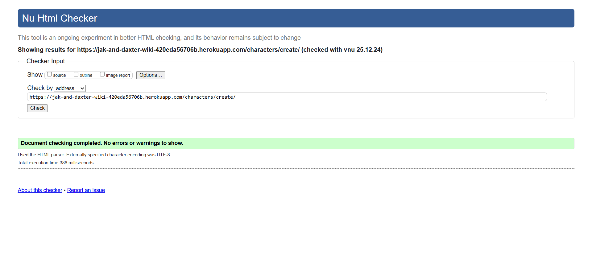 | No errors found |
| characters | character_list.html | Deployed page | 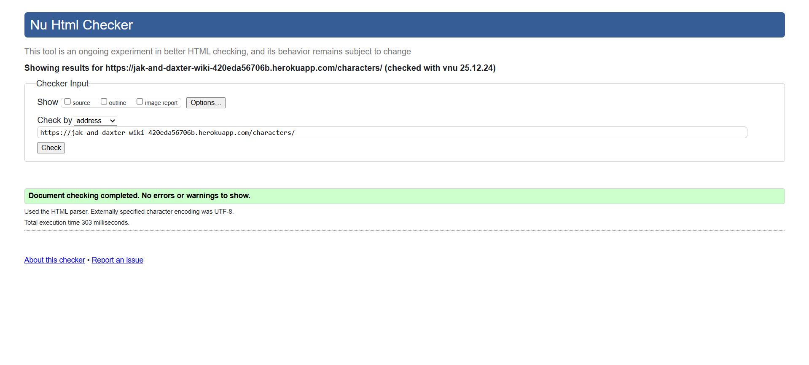 | No errors found |
| collectables | collectable_confirm_delete.html | Deployed page | 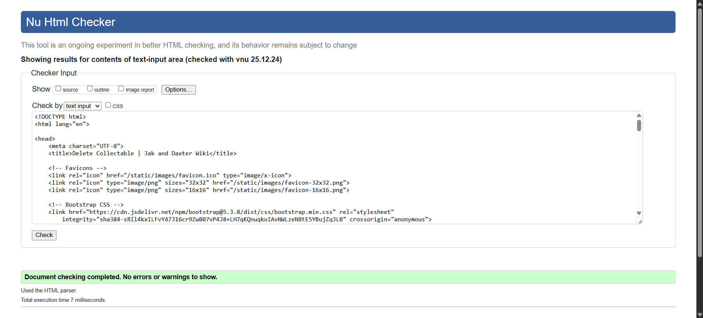 | No errors found |
| collectables | collectable_form.html | Deployed page | 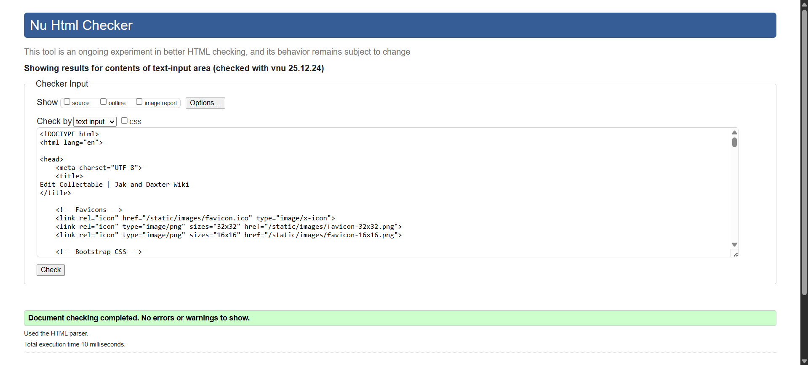 | No errors found |
| collectables | collectable_list.html | Deployed page |  | No errors found |
| home | index.html | Deployed page | 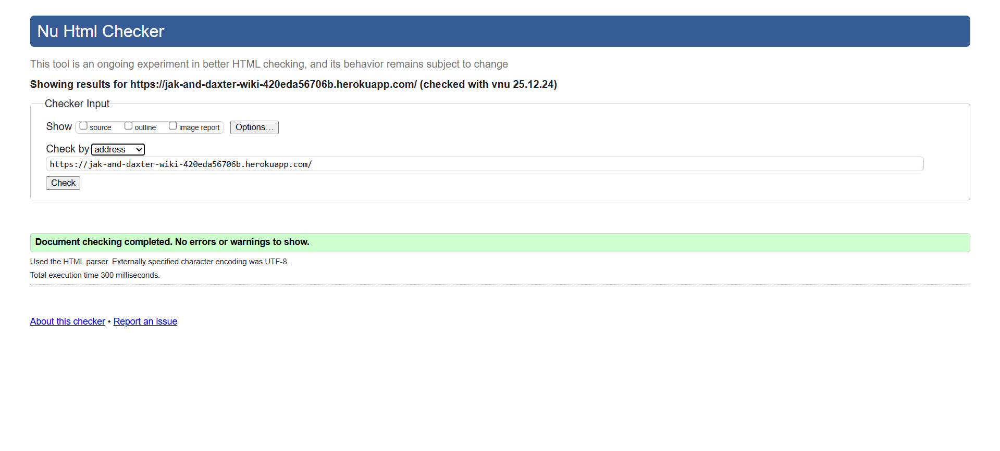 | No errors found |
| home | login.html | Deployed page | 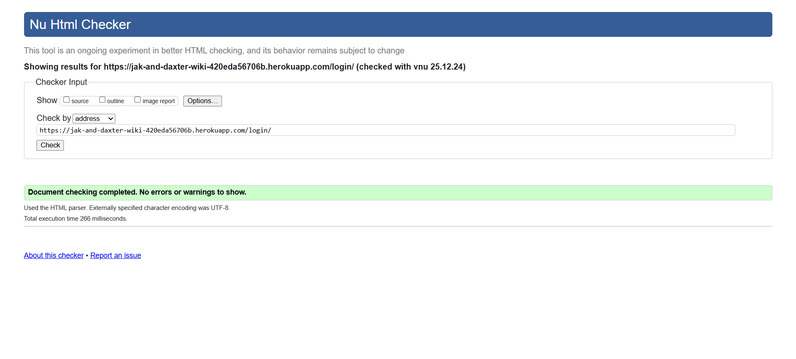 | No errors found |
| home | register.html | Deployed page | 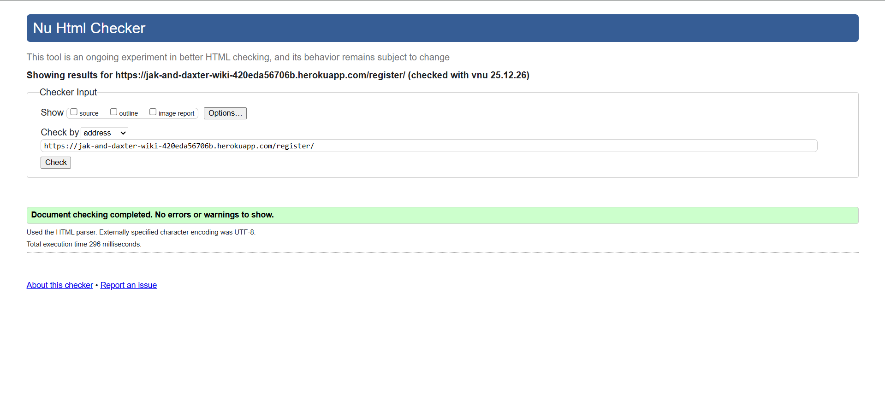 | No errors found |
| morphgun | create_colour.html | Deployed page | 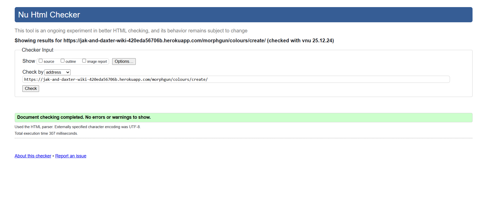 | No errors found |
| morphgun | create_weapon.html | Deployed page | 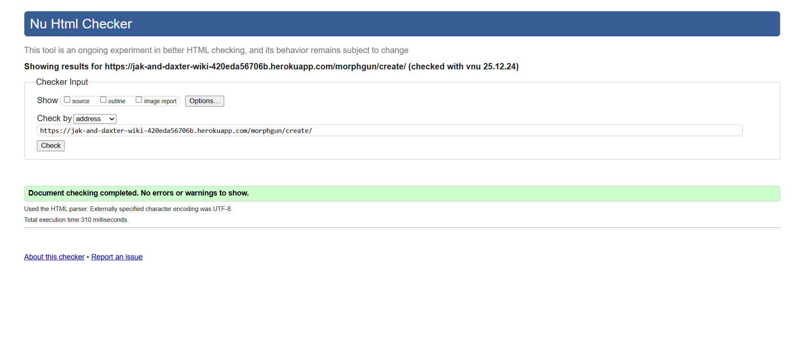 | No errors found |
| morphgun | delete_colour.html | Deployed page | 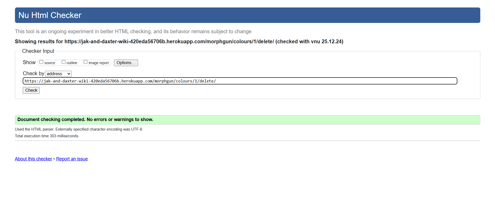 | No errors found |
| morphgun | delete_weapon.html | Deployed page | 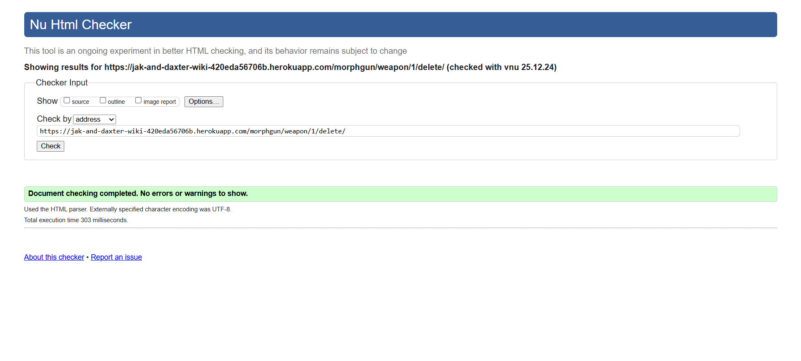 | No errors found |
| morphgun | rate_weapons.html | Deployed page | 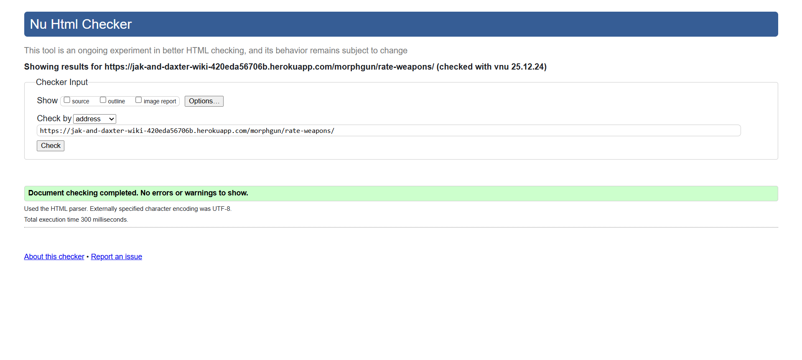 | No errors found |
| morphgun | weapon_rankings.html | Deployed page | 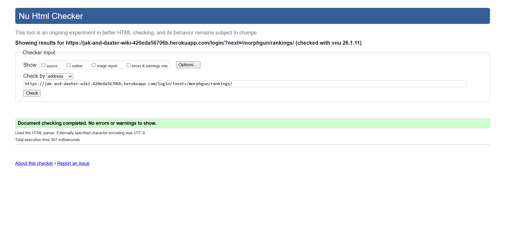 | No errors found |
| morphgun | update_colour.html | Deployed page | 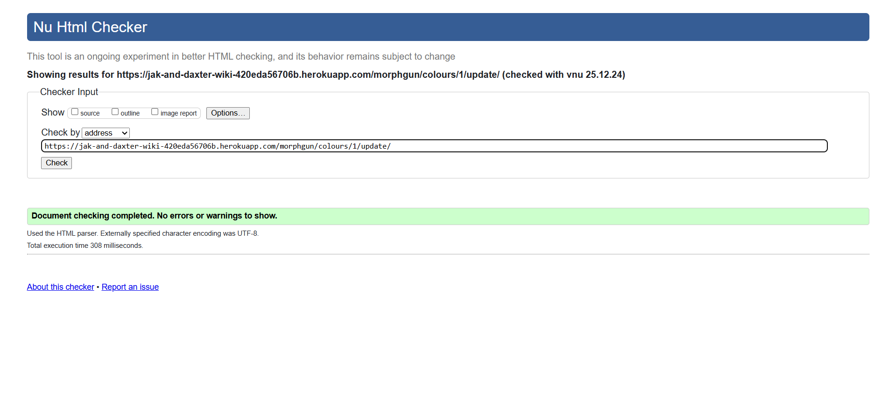 | No errors found |
| morphgun | update_weapon.html | Deployed page | 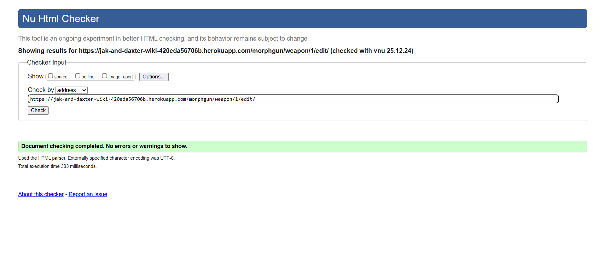 | No errors found |
| morphgun | weapon_detail.html | Deployed page |  | No errors found |
| morphgun | weapon_list.html | Deployed page | 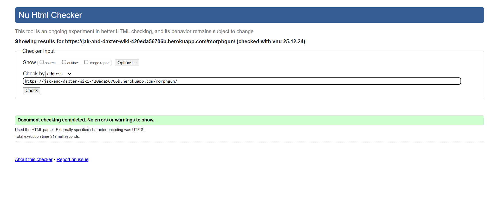 | No errors found |

---

#### Summary

- All validated HTML pages passed W3C validation.
- No critical errors were present in the rendered HTML output.
- Any potential warnings were related to third-party libraries or Django templating and were handled according to best practice.
- Validation confirms that the site structure is standards-compliant and production-ready.

---

### CSS

All custom CSS used in the **Jak and Daxter Wiki** project was validated using the official **W3C CSS Jigsaw Validator** to ensure compliance with current CSS standards and to identify any syntax or structural issues.

The project uses a single custom stylesheet located at `static/css/style.css`. Validation was carried out using **direct file input**, ensuring that all custom-written CSS was checked independently of third-party libraries.


#### Validation Tool Used

- [W3C CSS Jigsaw Validator](https://jigsaw.w3.org/css-validator)

> **Note on Third-Party Libraries:**  
> The project uses **Bootstrap** as a front-end framework. Any warnings or errors related to Bootstrap’s internal CSS were intentionally ignored, as external libraries are not required to be validated under Code Institute assessment guidelines.

---

#### Validation Results

| Directory | File | Validator URL | Screenshot | Notes |
| --- | --- | --- | --- | --- |
| static/css | [style.css](https://github.com/LouisCE/jak-and-daxter-wiki/blob/main/static/css/style.css) | https://jigsaw.w3.org/css-validator/validator?uri=https://jak-and-daxter-wiki-420eda56706b.herokuapp.com | 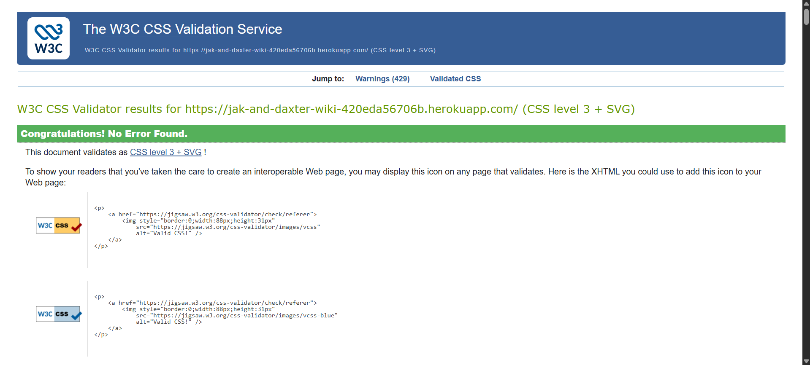 | No critical errors found in custom CSS. Bootstrap-related warnings ignored as expected. |

---

#### Summary

- All **custom-written CSS** for the project passed W3C validation.
- No syntax or structural errors were present in `style.css`.
- Any warnings encountered were related to **third-party Bootstrap CSS** and were therefore not applicable.
- Validation confirms that the site’s styling is robust, standards-compliant, and suitable for production deployment.

---

### JavaScript

As modern JavaScript (ES6) methods were used, the following line was included at the very top of the JavaScript file:

```js
/* jshint esversion: 11 */
```

This allows the JSHint validator to recognise modern JavaScript features such as `const`, arrow functions, and the `DOMContentLoaded` event listener.

JavaScript within the **Jak and Daxter Wiki** project is intentionally kept minimal and is used only to enhance user experience rather than core functionality.

The project includes a small JavaScript file to improve usability on the **Rate Weapons** page by disabling the submit button and displaying a loading indicator when the rating form is submitted. This prevents duplicate submissions and provides clear feedback to the user.

The project’s custom JavaScript file was validated using the recommended [JSHint Validator](https://jshint.com).

| Directory | File | URL | Screenshot | Notes |
| --- | --- | --- | --- | --- |
| static/js | rating.js | https://github.com/LouisCE/jak-and-daxter-wiki/blob/main/static/js/rating.js | 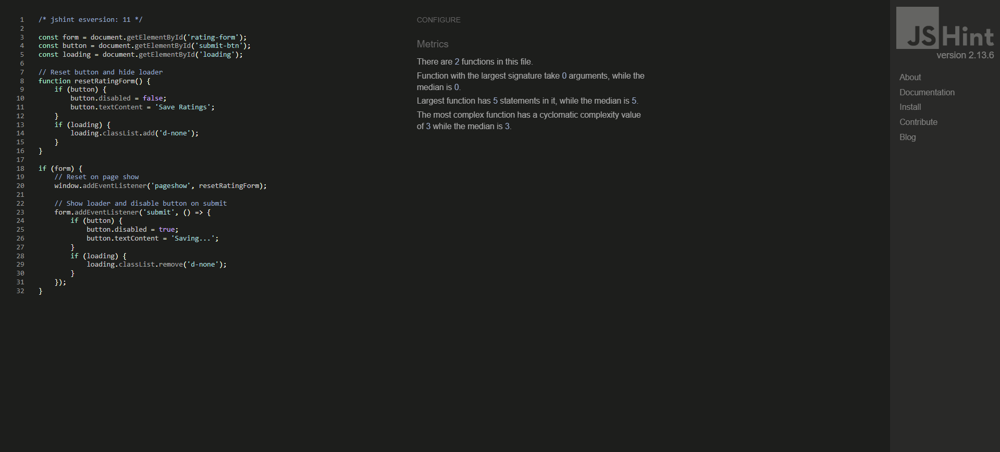 | No errors reported |

No errors or warnings were reported during validation, confirming that the JavaScript is clean, readable, and suitable for production use.

---

### Python

All custom Python code for the **Jak and Daxter Wiki** project was validated using the recommended **PEP8 CI Python Linter** to ensure compliance with PEP8 standards and general Python best practices.

Validation was carried out using the **API URL method**, as this provides a persistent validation link for each file and ensures that the exact deployed code is being checked.

- [PEP8 CI Python Linter](https://pep8ci.herokuapp.com)

---

#### Validation Approach

Each Python file was validated by:

1. Navigating to the file in the GitHub repository.
2. Selecting the **Raw** view to obtain the direct raw file URL.
3. Appending that URL to the PEP8 CI Python Linter base URL.
4. Running validation against the rendered raw file.

This approach ensures consistent and repeatable validation results.

---

#### Django Settings Considerations

The Django `settings.py` file includes several default configuration lines that exceed 80 characters and trigger the `E501 line too long` warning.

These lines were resolved using the recommended `# noqa` comment, as shortening them further would negatively impact clarity or break Django’s expected configuration structure.

```python
AUTH_PASSWORD_VALIDATORS = [
    {
        "NAME": "django.contrib.auth.password_validation.UserAttributeSimilarityValidator",  # noqa
    },
    {
        "NAME": "django.contrib.auth.password_validation.MinimumLengthValidator",  # noqa
    },
    {
        "NAME": "django.contrib.auth.password_validation.CommonPasswordValidator",  # noqa
    },
    {
        "NAME": "django.contrib.auth.password_validation.NumericPasswordValidator",  # noqa
    },
]
```

This approach aligns with CI guidance and avoids unnecessary refactoring of Django defaults.

---

#### Excluded Files

The following files and directories were intentionally excluded from validation, as they are auto-generated and not user-written:

- `migrations/`
- `__pycache__/`

Only files that were created or directly modified as part of the project were validated.

---

#### Python Validation Results

| Directory | File | URL | Screenshot | Notes |
| --- | --- | --- | --- | --- |
| characters | [admin.py](https://github.com/LouisCE/jak-and-daxter-wiki/blob/main/characters/admin.py) | [PEP8 CI Link](https://pep8ci.herokuapp.com/https://raw.githubusercontent.com/LouisCE/jak-and-daxter-wiki/main/characters/admin.py) |  | No issues found |
| characters | [models.py](https://github.com/LouisCE/jak-and-daxter-wiki/blob/main/characters/models.py) | [PEP8 CI Link](https://pep8ci.herokuapp.com/https://raw.githubusercontent.com/LouisCE/jak-and-daxter-wiki/main/characters/models.py) | 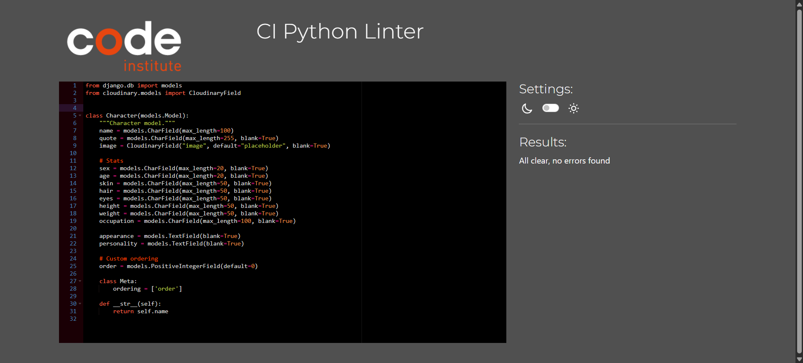 | No issues found |
| characters | [tests.py](https://github.com/LouisCE/jak-and-daxter-wiki/blob/main/characters/tests.py) | [PEP8 CI Link](https://pep8ci.herokuapp.com/https://raw.githubusercontent.com/LouisCE/jak-and-daxter-wiki/main/characters/tests.py) | 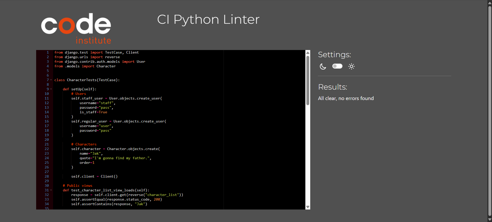 | No issues found |
| characters | [urls.py](https://github.com/LouisCE/jak-and-daxter-wiki/blob/main/characters/urls.py) | [PEP8 CI Link](https://pep8ci.herokuapp.com/https://raw.githubusercontent.com/LouisCE/jak-and-daxter-wiki/main/characters/urls.py) | 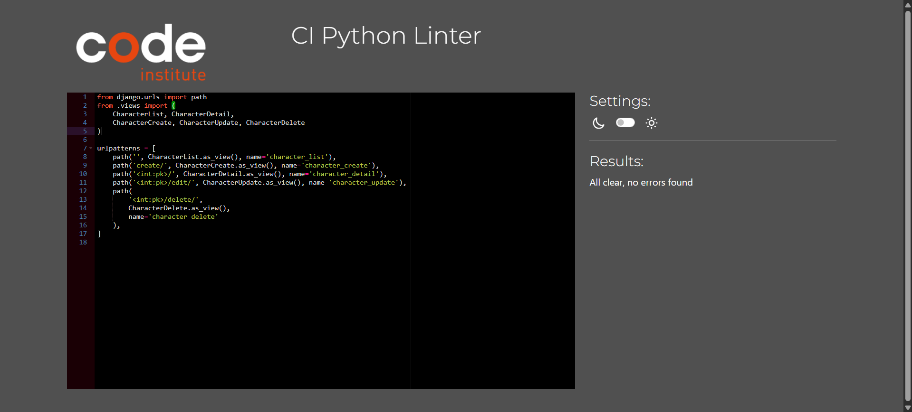 | No issues found |
| characters | [views.py](https://github.com/LouisCE/jak-and-daxter-wiki/blob/main/characters/views.py) | [PEP8 CI Link](https://pep8ci.herokuapp.com/https://raw.githubusercontent.com/LouisCE/jak-and-daxter-wiki/main/characters/views.py) | 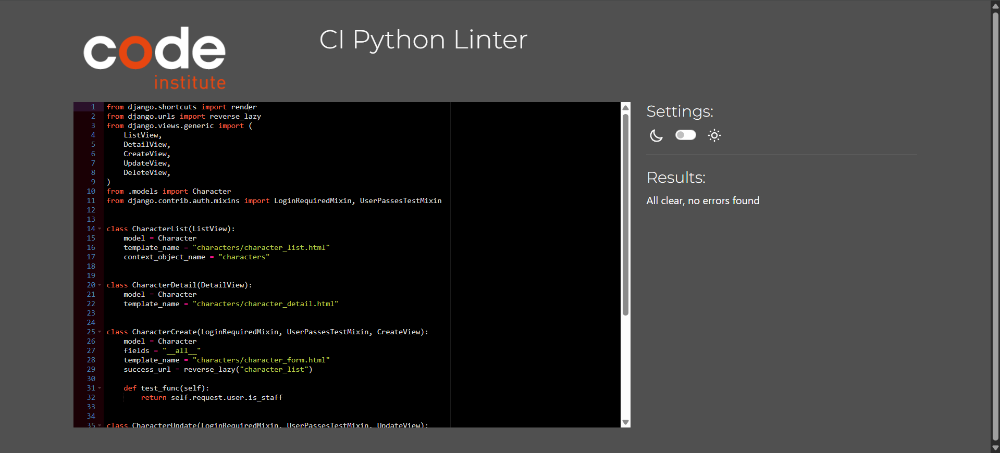 | No issues found |
| collectables | [admin.py](https://github.com/LouisCE/jak-and-daxter-wiki/blob/main/collectables/admin.py) | [PEP8 CI Link](https://pep8ci.herokuapp.com/https://raw.githubusercontent.com/LouisCE/jak-and-daxter-wiki/main/collectables/admin.py) | 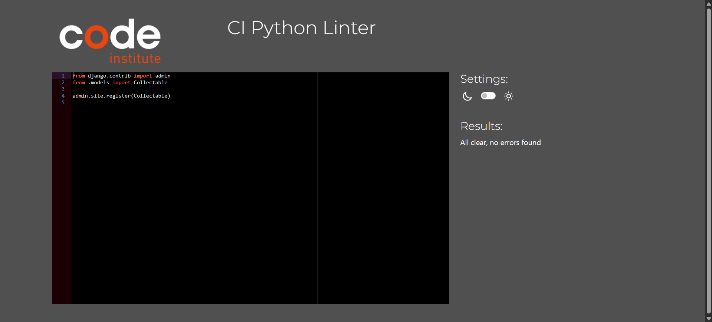 | No issues found |
| collectables | [forms.py](https://github.com/LouisCE/jak-and-daxter-wiki/blob/main/collectables/forms.py) | [PEP8 CI Link](https://pep8ci.herokuapp.com/https://raw.githubusercontent.com/LouisCE/jak-and-daxter-wiki/main/collectables/forms.py) | 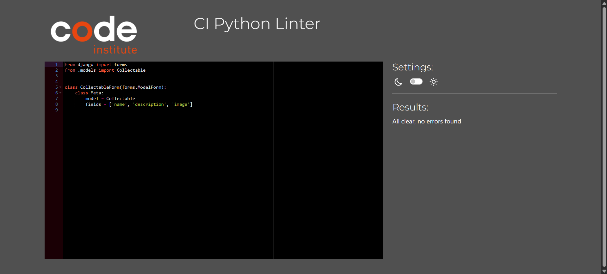 | No issues found |
| collectables | [models.py](https://github.com/LouisCE/jak-and-daxter-wiki/blob/main/collectables/models.py) | [PEP8 CI Link](https://pep8ci.herokuapp.com/https://raw.githubusercontent.com/LouisCE/jak-and-daxter-wiki/main/collectables/models.py) | 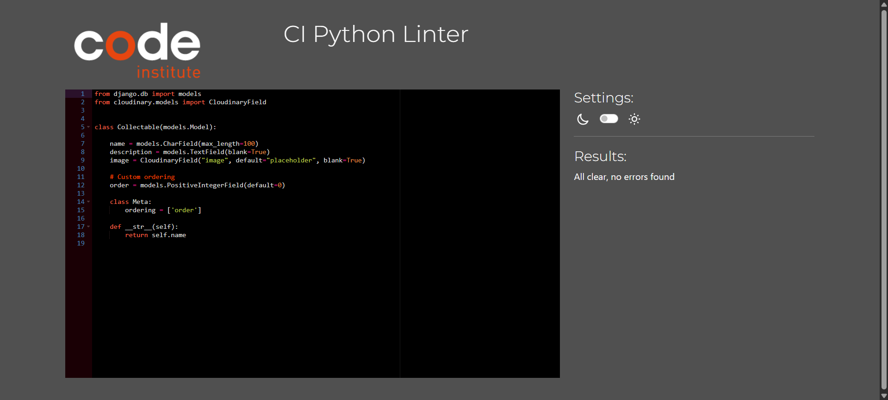 | No issues found |
| collectables | [tests.py](https://github.com/LouisCE/jak-and-daxter-wiki/blob/main/collectables/tests.py) | [PEP8 CI Link](https://pep8ci.herokuapp.com/https://raw.githubusercontent.com/LouisCE/jak-and-daxter-wiki/main/collectables/tests.py) |  | No issues found |
| collectables | [urls.py](https://github.com/LouisCE/jak-and-daxter-wiki/blob/main/collectables/urls.py) | [PEP8 CI Link](https://pep8ci.herokuapp.com/https://raw.githubusercontent.com/LouisCE/jak-and-daxter-wiki/main/collectables/urls.py) | 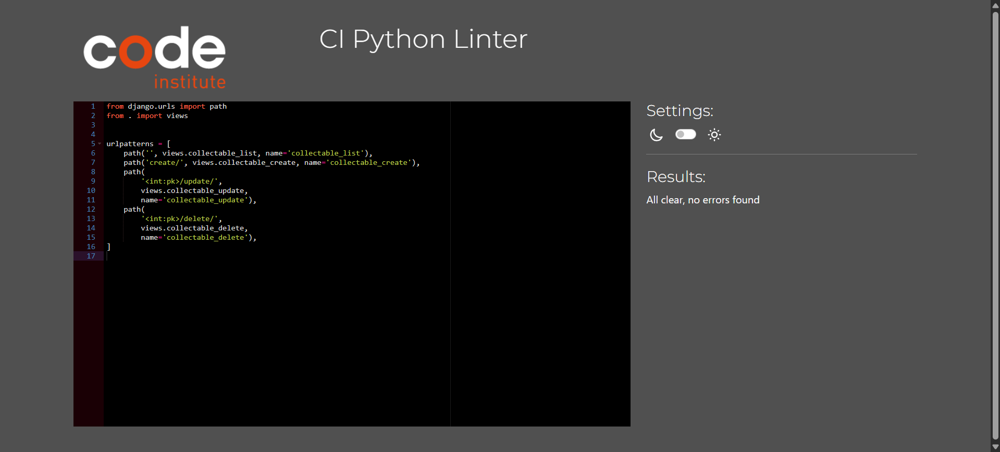 | No issues found |
| collectables | [views.py](https://github.com/LouisCE/jak-and-daxter-wiki/blob/main/collectables/views.py) | [PEP8 CI Link](https://pep8ci.herokuapp.com/https://raw.githubusercontent.com/LouisCE/jak-and-daxter-wiki/main/collectables/views.py) | 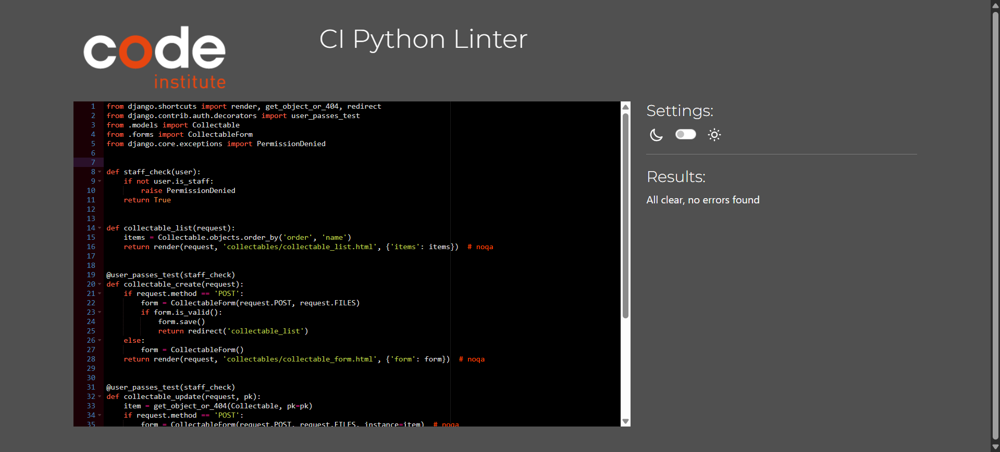 | No issues found |
| home | [admin.py](https://github.com/LouisCE/jak-and-daxter-wiki/blob/main/home/admin.py) | [PEP8 CI Link](https://pep8ci.herokuapp.com/https://raw.githubusercontent.com/LouisCE/jak-and-daxter-wiki/main/home/admin.py) | 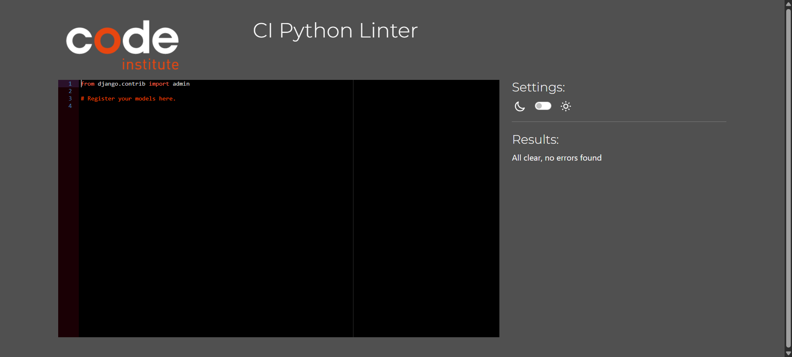 | No issues found |
| home | [forms.py](https://github.com/LouisCE/jak-and-daxter-wiki/blob/main/home/forms.py) | [PEP8 CI Link](https://pep8ci.herokuapp.com/https://raw.githubusercontent.com/LouisCE/jak-and-daxter-wiki/main/home/forms.py) | 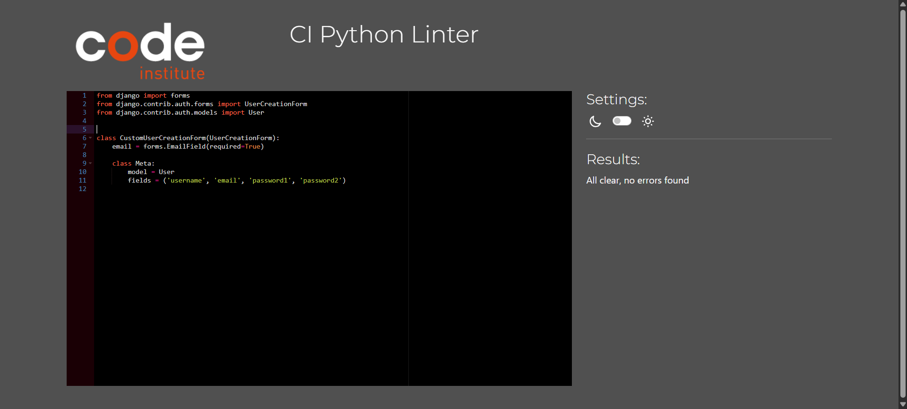 | No issues found |
| home | [models.py](https://github.com/LouisCE/jak-and-daxter-wiki/blob/main/home/models.py) | [PEP8 CI Link](https://pep8ci.herokuapp.com/https://raw.githubusercontent.com/LouisCE/jak-and-daxter-wiki/main/home/models.py) | 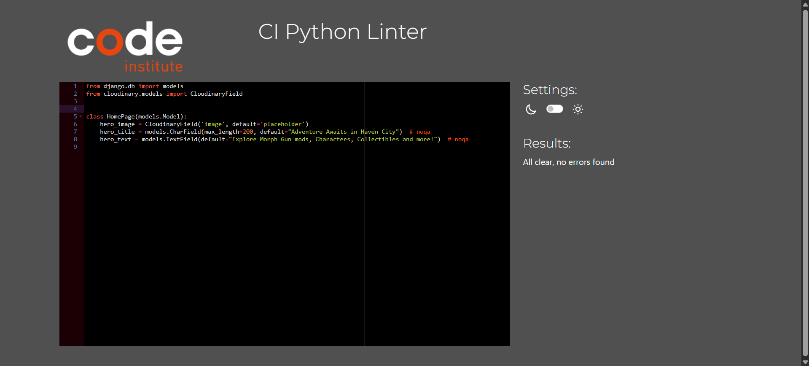 | No issues found |
| home | [tests.py](https://github.com/LouisCE/jak-and-daxter-wiki/blob/main/home/tests.py) | [PEP8 CI Link](https://pep8ci.herokuapp.com/https://raw.githubusercontent.com/LouisCE/jak-and-daxter-wiki/main/home/tests.py) | 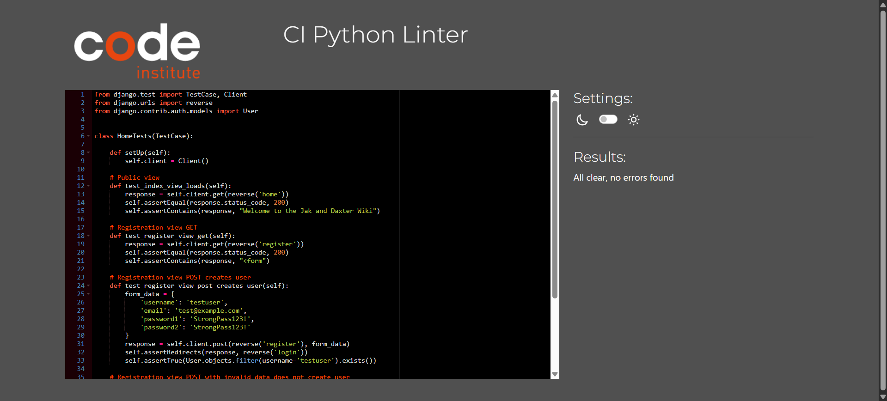 | No issues found |
| home | [urls.py](https://github.com/LouisCE/jak-and-daxter-wiki/blob/main/home/urls.py) | [PEP8 CI Link](https://pep8ci.herokuapp.com/https://raw.githubusercontent.com/LouisCE/jak-and-daxter-wiki/main/home/urls.py) | 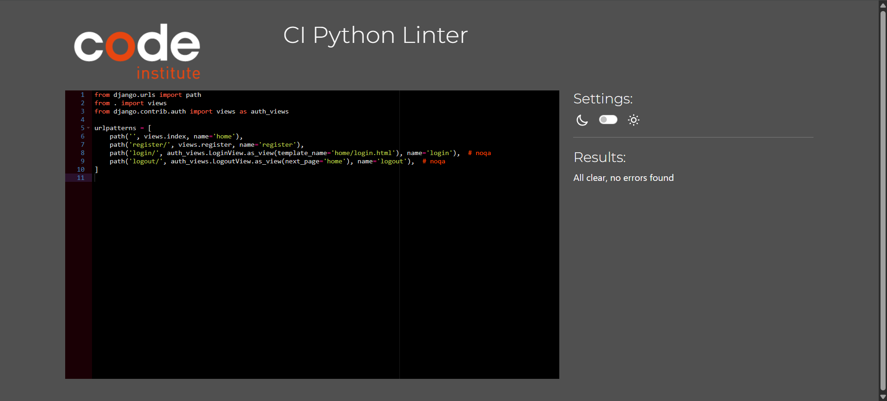 | No issues found |
| home | [views.py](https://github.com/LouisCE/jak-and-daxter-wiki/blob/main/home/views.py) | [PEP8 CI Link](https://pep8ci.herokuapp.com/https://raw.githubusercontent.com/LouisCE/jak-and-daxter-wiki/main/home/views.py) | 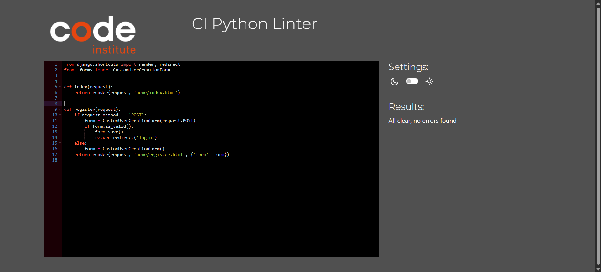 | No issues found |
| main | [settings.py](https://github.com/LouisCE/jak-and-daxter-wiki/blob/main/main/settings.py) | [PEP8 CI Link](https://pep8ci.herokuapp.com/https://raw.githubusercontent.com/LouisCE/jak-and-daxter-wiki/main/main/settings.py) | 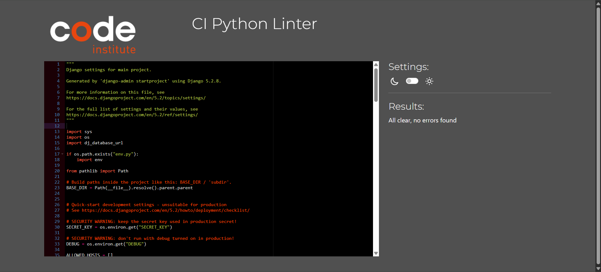 | `# noqa` used for Django defaults |
| main | [urls.py](https://github.com/LouisCE/jak-and-daxter-wiki/blob/main/main/urls.py) | [PEP8 CI Link](https://pep8ci.herokuapp.com/https://raw.githubusercontent.com/LouisCE/jak-and-daxter-wiki/main/main/urls.py) | 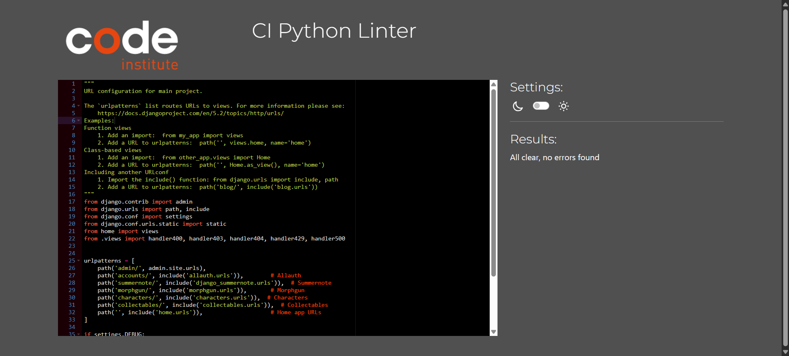 | No issues found |
| main | [views.py](https://github.com/LouisCE/jak-and-daxter-wiki/blob/main/main/views.py) | [PEP8 CI Link](https://pep8ci.herokuapp.com/https://raw.githubusercontent.com/LouisCE/jak-and-daxter-wiki/main/main/views.py) | 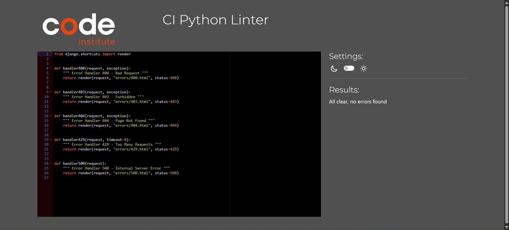 | No issues found |
|  | [manage.py](https://github.com/LouisCE/jak-and-daxter-wiki/blob/main/manage.py) | [PEP8 CI Link](https://pep8ci.herokuapp.com/https://raw.githubusercontent.com/LouisCE/jak-and-daxter-wiki/main/manage.py) | 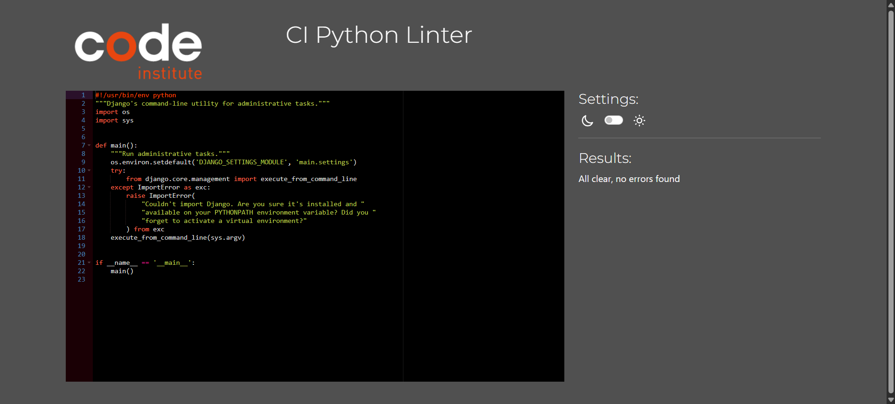 | No issues found |
| morphgun | [admin.py](https://github.com/LouisCE/jak-and-daxter-wiki/blob/main/morphgun/admin.py) | [PEP8 CI Link](https://pep8ci.herokuapp.com/https://raw.githubusercontent.com/LouisCE/jak-and-daxter-wiki/main/morphgun/admin.py) | 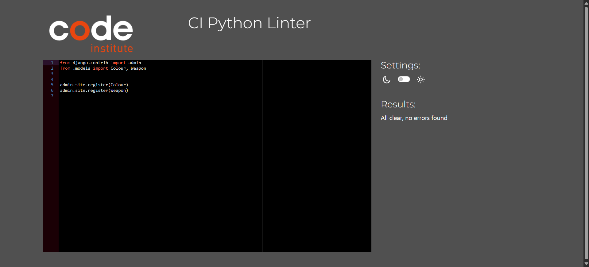 | No issues found |
| morphgun | [forms.py](https://github.com/LouisCE/jak-and-daxter-wiki/blob/main/morphgun/forms.py) | [PEP8 CI Link](https://pep8ci.herokuapp.com/https://raw.githubusercontent.com/LouisCE/jak-and-daxter-wiki/main/morphgun/forms.py) | 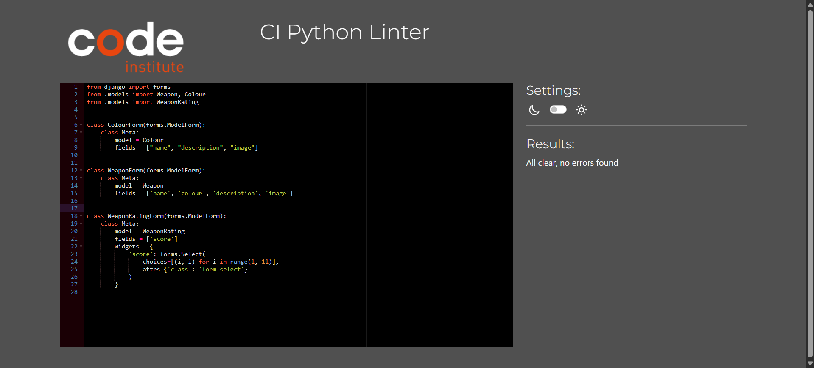 | No issues found |
| morphgun | [models.py](https://github.com/LouisCE/jak-and-daxter-wiki/blob/main/morphgun/models.py) | [PEP8 CI Link](https://pep8ci.herokuapp.com/https://raw.githubusercontent.com/LouisCE/jak-and-daxter-wiki/main/morphgun/models.py) | 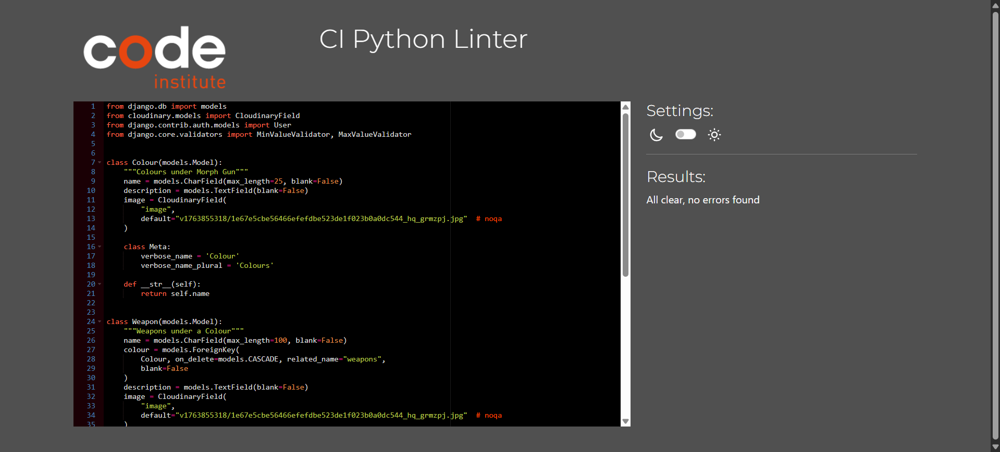 | No issues found |
| morphgun | [tests.py](https://github.com/LouisCE/jak-and-daxter-wiki/blob/main/morphgun/tests.py) | [PEP8 CI Link](https://pep8ci.herokuapp.com/https://raw.githubusercontent.com/LouisCE/jak-and-daxter-wiki/main/morphgun/tests.py) | 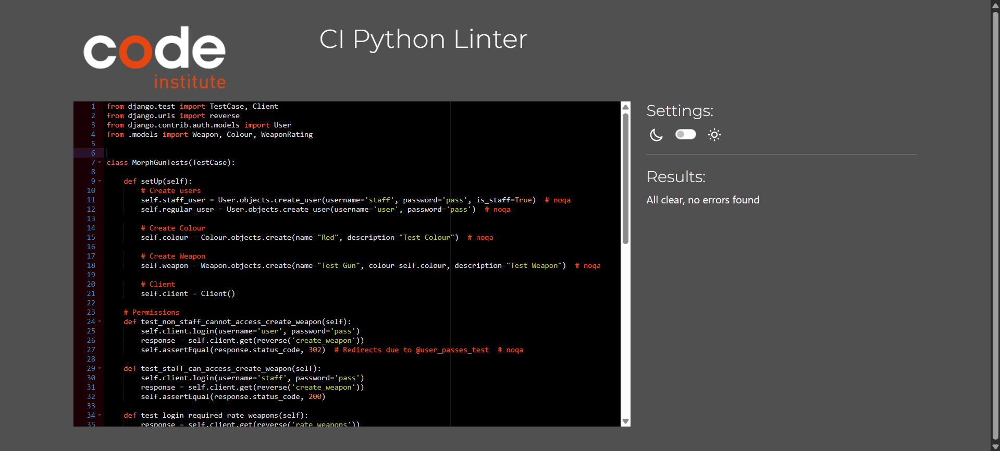 | No issues found |
| morphgun | [urls.py](https://github.com/LouisCE/jak-and-daxter-wiki/blob/main/morphgun/urls.py) | [PEP8 CI Link](https://pep8ci.herokuapp.com/https://raw.githubusercontent.com/LouisCE/jak-and-daxter-wiki/main/morphgun/urls.py) | 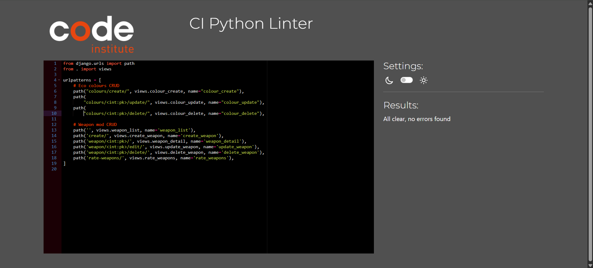 | No issues found |
| morphgun | [views.py](https://github.com/LouisCE/jak-and-daxter-wiki/blob/main/morphgun/views.py) | [PEP8 CI Link](https://pep8ci.herokuapp.com/https://raw.githubusercontent.com/LouisCE/jak-and-daxter-wiki/main/morphgun/views.py) | 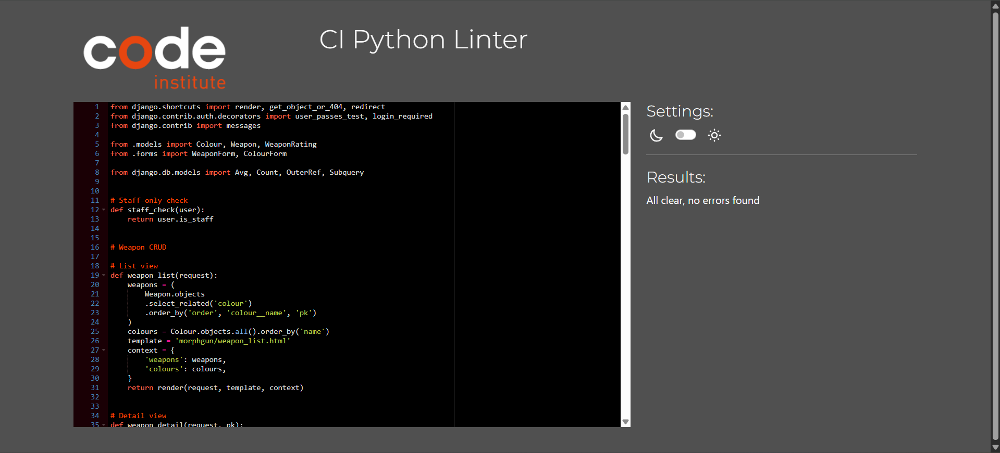 | No issues found |

---

#### Summary

- All validated Python files passed PEP8 validation.
- No unresolved linting errors remain.
- `# noqa` was used sparingly and only where recommended.
- Auto-generated files were correctly excluded.
- Validation confirms that the backend codebase is clean, readable, and production-ready.

---

## Accessibility

The **WAVE Web Accessibility Evaluation Tool** was used to assess the accessibility of the **Jak and Daxter Wiki** project. WAVE was run using the following URL:

- [WAVE Web Accessibility Evaluation Tools](https://wave.webaim.org/report#/https://jak-and-daxter-wiki-420eda56706b.herokuapp.com)

### Summary

- **No Errors**
- **No Contrast Errors**

During early testing, WAVE identified a **contrast error** on the Weapon List page. This was caused by the original deep purple eco colour having insufficient contrast against the dark background.

To resolve this, custom CSS was implemented to adjust eco colours and **purple** was changed to **magenta** for greater contrast.

Although WAVE did not flag the other eco colours as contrast errors, I thought the **blue** styling was quite low contrast as well, so I changed it to **cyan**.

**Red** and **yellow** already had good accessibility but I decided to brighten those shades as well to improve contrast ratios for extra pop against the dark background and to unify the eco-charged aesthetic.

These changes significantly improved accessibility while maintaining the visual identity of the project.

### Alerts

WAVE reports a small number of **alerts**, including:

- **Redundant links**
  WAVE reports some redundant link alerts where adjacent navigation links point to the same destination.
  
  This alert occurs in the main navigation where multiple adjacent links resolve to the same destination.
  
  Examples include navigation links where adjacent items resolve to the same destination, such as the **Home** link and the **Weapon Overview** dropdown item both pointing to pages that are already linked elsewhere in the main navigation.

  These alerts do not prevent navigation or interaction, but may result in minor repetition for keyboard and screen reader users. The structure was intentionally retained to maintain clear navigation and consistent user experience across devices.

  As these alerts do not introduce accessibility barriers or functional issues, they were considered acceptable within the scope of the project.

- **Skipped heading levels**
  These occur intentionally to maintain consistent heading structures across pages that share common layouts and templates.

These alerts are considered **minor** and **non-critical**, and they do not impact the usability or functionality of the website.

---

### WAVE Results by Page

| Page | Screenshot | Notes |
|-----|------------|-------|
| Home | 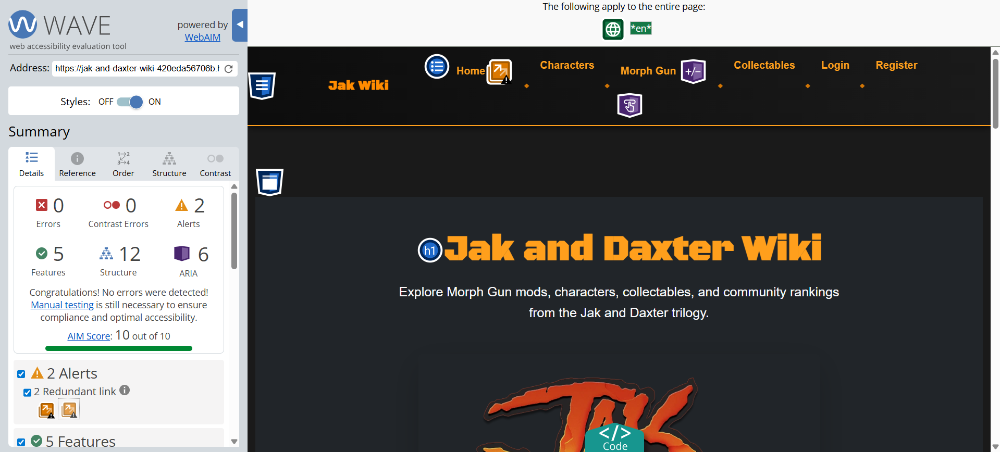 | No errors or contrast errors |
| Character List | 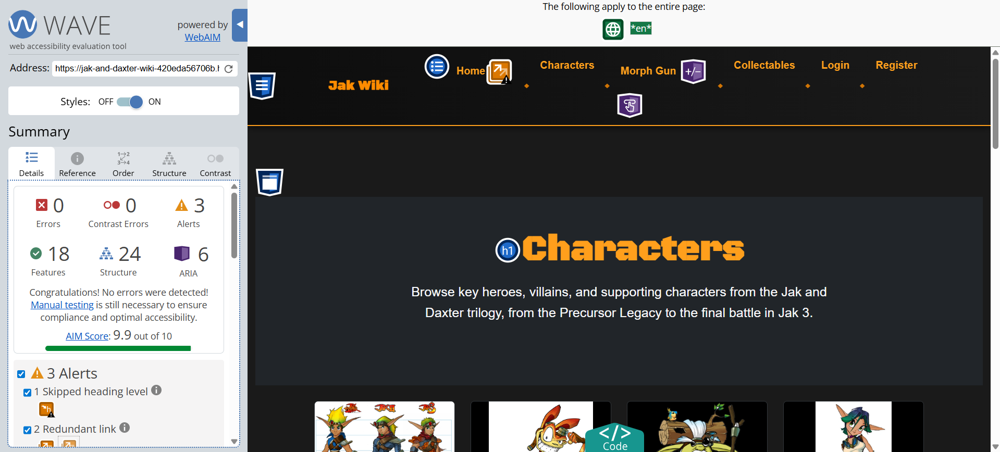 | No errors or contrast errors |
| Character Detail | 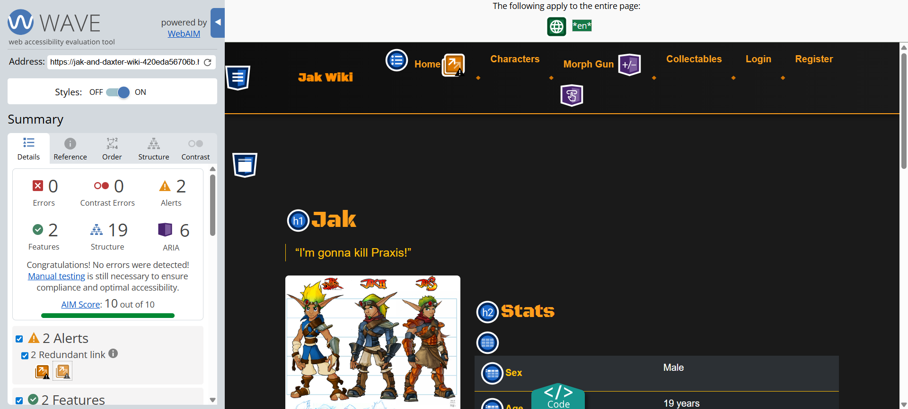 | No errors or contrast errors |
| Weapon List | 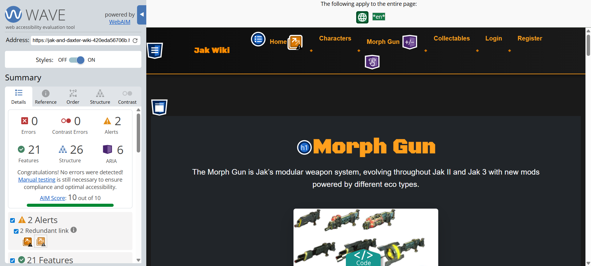 | No errors or contrast errors; initial contrast issue resolved with CSS |
| Weapon Detail | 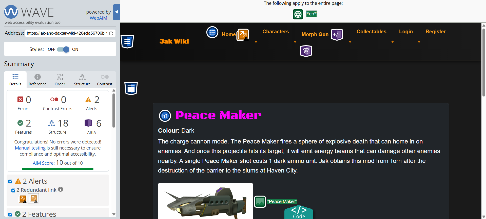 | No errors or contrast errors; initial contrast issue resolved with CSS |
| Collectable List | 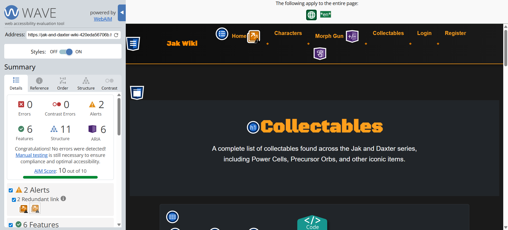 | No errors or contrast errors |
| Login | 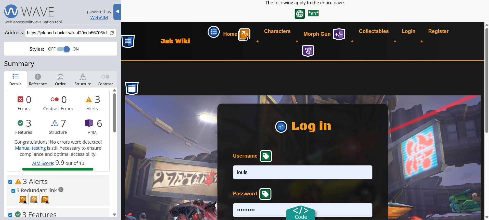 | No errors or contrast errors |
| Register |  | No errors or contrast errors |
| 404 |  | No errors or contrast errors |

Overall, the **Jak and Daxter Wiki** meets accessibility expectations, with all critical issues addressed and only minor, non-blocking alerts remaining.

---

## Responsiveness

This section documents responsiveness testing carried out on the **deployed** version of the Jak and Daxter Wiki project. Testing was completed using built-in device presets within browser Developer Tools to ensure accurate rendering across common screen sizes.

The following device sizes were tested:

- Mobile (iPhone SE)
- Tablet (iPad Mini)
- Desktop (Nest Hub Max)

Screenshots are provided as evidence of testing.

I tested the live deployed site to ensure layout, navigation, images, and interactive elements respond correctly across different screen sizes.

| Page | Mobile | Tablet | Desktop | Notes |
| --- | --- | --- | --- | --- |
| Home |  |  |  | Layout remains consistent across devices; content scales proportionally |
| Character List |  |  |  | Card layout scales to fit screen size |
| Character Detail |  |  |  | Image and content layout remains consistent and resizes correctly |
| Weapon List |  |  |  | Weapon cards wrap correctly; colour sections remain visually distinct |
| Weapon Detail |  |  |  | Images scale responsively; action buttons remain accessible |
| Rate Weapons |  |  |  | Table layout remains identical and scales to fit available space |
| Weapon Rankings |  |  |  | Table structure remains unchanged across screen sizes |
| Collectable List |  |  |  | Table layout scales; images resize without distortion |
| Login |  |  |  | Form remains readable and usable at all sizes |
| Register |  |  |  | Inputs and buttons scale correctly |
| Admin CRUD Pages |  |  |  | Forms remain usable and readable across all devices |

Overall, the site maintains usability and visual consistency across mobile, tablet, and desktop screen sizes. Bootstrap’s grid system combined with custom CSS ensures responsive behaviour without layout breakage.

---

## Browser Compatibility

The **Jak and Daxter Wiki** was tested on multiple modern web browsers to ensure consistent appearance, functionality, and user experience across different platforms. All testing was carried out on the **live deployed site** rather than the local development environment.

The following browsers were selected as they are commonly used and readily available on the development system:

- Google Chrome
- Microsoft Edge
- Mozilla Firefox


Screenshots were captured during testing to demonstrate that each page loads and functions correctly in each browser.

---

### Tested Pages

| Page | Chrome | Edge | Firefox | Notes |
| --- | --- | --- | --- | --- |
| Home |  |  |  | Renders correctly and functions as expected |
| Character List |  |  |  | Layout and navigation behave as expected |
| Character Detail |  |  |  | Content and styling consistent across browsers |
| Weapon List |  |  |  | Cards and layout display consistently |
| Weapon Detail |  |  |  | Images and text render correctly |
| Rate Weapons |  |  |  | Rating table renders correctly |
| Weapon Rankings |  |  |  | User and community ranking tables render correctly |
| Collectable List |  |  |  | Images and text render correctly |
| Login |  |  |  | Authentication form works correctly |
| Register |  |  |  | Form validation and help text display correctly |
| 404 Error Page |  |  |  | Custom error page displays correctly |

---

### Summary

No browser-specific issues were identified during testing. The application behaves consistently across all tested browsers, with no visual layout problems or functional discrepancies observed.

---

## Lighthouse Audit

The **Jak and Daxter Wiki** was tested using Google Chrome’s **Lighthouse** tool on the **live deployed site**, rather than the local development environment. Testing the deployed version ensures that results accurately reflect real-world performance, accessibility, and best practices. Audits were run in **Chrome Incognito mode** to minimise the impact of browser extensions, cached assets, and user-specific data on the results.

Each key page was tested on both **mobile** and **desktop** profiles. As expected, mobile scores are generally lower due to network throttling and device constraints, while desktop results score higher overall.

---

### Lighthouse Results

| Page | Mobile | Desktop |
| --- | --- | --- |
| Home |  |  |
| Character List |  |  |
| Character Detail |  |  |
| Weapon List |  |  |
| Weapon Detail |  |  |
| Rate Weapons |  |  |
| Weapon Rankings |  |  |
| Collectable List |  |  |
| Login |  |  |
| Register |  |  |

---

### Audit Summary

- **Performance**  
  Scores are affected primarily by image-heavy content and external resources. Images are optimised where possible and served responsively.

- **Accessibility**  
  Semantic HTML, clear headings, alt text on images, and strong colour contrast contribute to consistently high accessibility scores.

- **Best Practices**  
  The site follows Django security standards, uses HTTPS in production, and avoids deprecated APIs.

- **SEO**  
  Page titles, meta structure, and crawlable content ensure good SEO compliance across the site.

Overall, the Lighthouse Audit confirms that the site meets modern web standards and performs reliably across devices and screen sizes with all categories scoring equal to or above 90.

---

## Defensive Programming

Defensive programming principles were applied throughout the **Jak and Daxter Wiki** to protect against invalid input, unauthorised access, and unexpected user behaviour.

All forms, views, and routes were manually tested using different user roles (guest user, authenticated user, and admin user) to ensure the application behaves securely and predictably.

The focus of testing was to confirm that:

- Users cannot submit invalid or empty form data
- Non-authenticated users cannot access restricted functionality
- Non-admin users cannot access admin-only features
- Users cannot manipulate data they do not own (User A should not be able to manipulate data belonging to User B, or vice versa)
- Invalid or malicious requests are handled gracefully using custom error pages

---

Defensive programming was manually tested with the below user acceptance testing:

| Area | Expectation | Test Performed | Result | Screenshot |
| --- | --- | --- | --- | --- |
| User Registration | Users should not be able to submit empty registration forms | Attempted to submit the register form with missing fields | Form validation prevented submission and displayed errors |  |
| User Authentication | Only registered users should be able to log in | Attempted login with valid and invalid credentials | Valid credentials allowed access; invalid credentials were rejected |  |
| CSRF Protection | Forms should reject unauthorised POST requests | Removed the CSRF token from `rate_weapons.html` and submitted the request | Django blocked the request with a 403 CSRF verification error |  |
| Authenticated Navigation | Navigation options should change based on login status | Viewed navbar as guest and as logged-in user | Login/Register links shown to guests; Logout shown to authenticated users |  |
| Restricted Pages | Guest users should not access protected pages | Attempted to access `/morphgun/rate-weapons/` while logged out | User was redirected to the login page with the intended URL preserved via the `next` parameter |  |
| Admin Protection | Non-admin users should not access the Django admin panel | Attempted to access `/admin` as a non-admin user | User was redirected to the Django admin login page, preventing unauthorised access |  |
| Data Integrity (Ratings) | Users should only be able to submit or update their own weapon ratings | Logged in as `louis` and submitted ratings, then logged in as `test` and submitted separate ratings for the same weapons | Each user’s ratings were stored separately and could not overwrite or modify another user’s ratings | N/A |
| 400 Error Handling | Bad requests should be handled gracefully | Triggered an invalid request | Custom 400 error page was displayed |  |
| 403 Error Handling | Forbidden access should be clearly communicated | Attempted to access restricted content | Custom 403 error page was displayed |  |
| 404 Error Handling | Non-existent pages should not crash the app | Navigated to an invalid URL | Custom 404 error page was displayed |  |
| Rate Limiting | Excessive requests should be limited | Triggered rate-limited behaviour during testing | Custom 429 error page was displayed |  |
| Server Errors | Server-side issues should fail safely | Simulated a server error during development | Custom 500 error page was displayed |  |

---

- Django’s built-in **authentication and authorisation** systems are used to control access
- **CSRF protection** is enabled on all forms
- Role-based access ensures **guests, users, and admins** see only permitted features
- Custom **400, 403, 404, 429, and 500** error pages prevent exposure of sensitive information
- All invalid or unexpected behaviour is handled gracefully without breaking the application

These measures ensure the site remains secure, user-friendly, and resilient against incorrect or malicious usage.

---

## User Story Testing

User Story Testing was carried out by manually verifying that each implemented feature met the expectations defined in the refined User Stories for the project. User stories were updated during development to better reflect the final scope and implemented functionality, following an Agile and iterative workflow.

Each User Story below was tested against the live deployed application to confirm that the expected behaviour and outcome were achieved.

Where applicable, screenshots have been reused from the **Features** section to avoid duplication and to clearly demonstrate working functionality.

| Target | Expectation | Outcome | Screenshot |
| --- | --- | --- | --- |
| As a guest user | I want a homepage that gives an overview of the three core Jak and Daxter games. | The homepage presents an overview of the Jak and Daxter trilogy, introducing users to the games and directing them to key sections of the site. |  |
| As a guest user | I want to view information about characters | Dedicated character pages display information about major characters within the Jak and Daxter universe. |  |
| As a guest user | I want to see the morph gun weapon mods organised by eco colour | Morph Gun weapon mods are grouped by eco colour, allowing users to easily browse and compare related weapons. |  |
| As a guest user | I want an overview of each weapon mod with descriptions and upgrading availability. | Each weapon mod page includes descriptive text and information about upgrade availability across the games. |  |
| As a guest user | I want to view collectibles like Precursor Orbs and Power Cells | A dedicated Collectables section displays information about optional in-game items such as Precursor Orbs and Power Cells. |  |
| As a guest user | I want to see images across all website apps. | Images are consistently displayed across morphgun, characters, collectibles, and other content to support visual recognition. | (See above.) |
| As a registered user | I want to sign up, log in, and log out | Users can register an account, log in securely, and log out using Django’s built-in authentication system. |   |
| As a registered user | I want to rate the twelve morph gun mods out of ten. | Authenticated users can submit ratings for each Morph Gun weapon mod, contributing to overall community ratings. |  |
| As a registered user | I want the community rankings to show a change indicator. | Added change indicators that show if a weapon mod has been promoted or demoted by the user's votes and by how many places |   |
| As a registered user | I want my account and weapon ratings to be secure | Authentication and permission controls ensure that only logged-in users can submit ratings and that ratings cannot be altered by other users. |   |
| As an admin user | I want CRUD functionality across all website apps. | Admin users can create, read, update, and delete content across all site apps using the Django admin interface. |   |
| As an admin user | I want to be able to select a colour when creating new eco types and weapon mods | Added a colour picker that allows admins to access styling from CRUD functionality | 

---

## Bugs

For convenience, I have used manual logs to track bugs during development.

### Fixed Bugs

Below is a detailed summary of the most significant bugs that I encountered and fixed during the project:

---

#### 1. Heroku CLI Not Detectable in PowerShell  
**Issue:**  
PowerShell could not find the `heroku` command unless I typed the full path:

```bash
& 'C:\Program Files\heroku\bin\heroku.cmd'
```

**Cause:**  
The Python virtual environment PATH on Windows overshadowed the system PATH.

**Fix:**  
Stopped relying on the CLI entirely, as recommended by Mentor Tim, and used the Heroku Dashboard instead.

---

#### 2. Heroku Was Not Updating Deployed Changes  
**Issue:**  
My local project worked perfectly, but Heroku stopped showing updates whenever I clicked **Deploy Branch**.  
At first I thought it was the Heroku CLI being broken, because commands on PowerShell failed unless I prefixed them with the full path to `heroku.cmd`.

**Cause:**  
It turned out the problem was *not* the CLI, my Heroku deployment was crashing due to internal server errors on the `/morphgun/` page, so the deploy “succeeded” but the app couldn't load.

**Fix:**  
Investigated logs, identified a failing URL pattern and a missing database configuration (see below), then redeployed.

---

#### 3. PostgreSQL vs SQLite Confusion  
**Issue:**  
I believed my local data should automatically appear on Heroku. Superuser accounts also didn’t match.

**Cause:**  
SQLite was being used locally, while Heroku always uses PostgreSQL.  
These databases are completely separate.

**Fix:**  
Used PostgreSQL for both environments by putting Heroku’s `DATABASE_URL` into `env.py`.  
Later learned SQLite is only needed when writing unit tests.

---

#### 4. Local Database Did Not Match Heroku Database  
**Issue:**  
I could not log into the Heroku admin panel and none of my weapon objects or colour objects appeared on Heroku.

**Cause:**  
My local environment had no `DATABASE_URL` variable, meaning Django was using SQLite locally.  
Heroku, however, was using PostgreSQL.  
Because they were completely separate, all migrations and superuser accounts were out of sync.

**Fix:**  
Added the same PostgreSQL `DATABASE_URL` from Heroku into my local `env.py` file so both environments used the same database.

---

#### 5. DEBUG and ALLOWED_HOSTS Blocking Error Visibility on Heroku  
**Issue:**  
Heroku only displayed a generic **Application Error**, making debugging impossible.

**Cause:**  
`DEBUG` was hard-coded in `settings.py`, preventing temporary debugging on Heroku.

**Fix:**  
Refactored `settings.py` to use environment variables:
```python
DEBUG = os.environ.get("DEBUG")
ALLOWED_HOSTS = []
CSRF_TRUSTED_ORIGINS = []

host = os.environ.get("HOST")
if host:
    ALLOWED_HOSTS.append(host)
    CSRF_TRUSTED_ORIGINS.append(f"https://{host}")
```
Then temporarily added `DEBUG=True` on Heroku (later removed).

---

### 6. Static Files Not Loading on Deployment  
**Issue:**  
CSS/images failed to load on Heroku.

**Cause:**  
Static folder placed in wrong directory before WhiteNoise integration.

**Fix:**  
Moved `/static/` to project root and updated settings.

---

#### 7. Placeholder `settings.py` Code Broke Deployment  
**Issue:**  
Heroku was throwing a 500 error on the homepage even before I built new features.

**Cause:**  
I had placeholder/incomplete configuration still inside `settings.py`, which crashed production.

**Fix:**  
Removed the placeholder code and applied the corrected configuration method provided by Mentor Tim.

---

#### 8. App Naming Structure Mistake (“weapons” Should’ve Been “morphgun”)  
**Issue:**  
Originally created the `morphgun` app as `weapons`, but the logical structure should have been:

```
morphgun/
    colours/
        weapons/
```

Instead, my structure became:

```
weapons/
    colours/
        weapons/
```

**Fix:**  
Created a new `morphgun` app and migrated all the code there. After verifying the new app worked, I safely deleted the old `weapons` app after migrations.

---

#### 9. Navbar and Templates Not Rendering Due to Structure Changes  
**Issue:**  
After moving everything into the new `morphgun` app, templates stopped rendering correctly.

**Cause:**  
Template directories changed, but some old paths still referenced `weapons/` instead of `morphgun/`.

**Fix:**  
Updated all template directory paths, `` references, and view imports to match the new app structure.

---

### 10. Template Inheritance Errors After Adding base.html   
**Issue:**  
Pages lost styling or rendered incorrectly.

**Cause:**  
Templates still using old paths like `morphgun/base.html`.

**Fix:**  
Converted all templates to ``.

---

#### 11. Internal Server Error (500) on `/morphgun/`  
**Issue:**  
Locally the page worked, but on Heroku it threw a 500 error.

**Cause:**  
The `weapon_list.html` template linked to  
``  
but in `morphgun/urls.py` the detail view path was missing the `weapon/` prefix.  
It expected:  
`path('weapon/<int:pk>/', ...)`

**Fix:**  
Updated the URL pattern:
```python
path("weapon/<int:pk>/", views.weapon_detail, name="weapon_detail")
```
Redeployment fixed the routing error.

---

### 12. Character Pages Returning 404  
**Issue:**  
Character CRUD existed but pages gave "URL not found".

**Cause:**  
Forgot to add URL patterns for list/detail/create/edit/delete.

**Fix:**  
Added full URL config and connected to templates.

---

### Known Issues

| Issue | Screenshot |
| --- | --- |
| Custom Django error pages (e.g. 400, 403, 404, 429, 500) cannot be validated directly using the W3C HTML Validator. This is because these pages intentionally return non-200 HTTP status codes, causing the validator to reject the request before validation can occur. This is a known limitation of the validator rather than an issue with the project’s HTML. |  |
| Lighthouse SEO scores for custom error pages (e.g. 400, 403, 404, 429, 500) are lower than standard pages. This is expected behaviour, as Lighthouse cannot fully audit pages that intentionally return non-200 HTTP status codes. The reduced score reflects a limitation of the testing tool rather than an issue with the project’s SEO implementation. |  |

> [!IMPORTANT]  
> There are no remaining bugs that I am currently aware of. However, despite thorough manual and automated testing, it is not possible to guarantee that all edge cases have been identified.